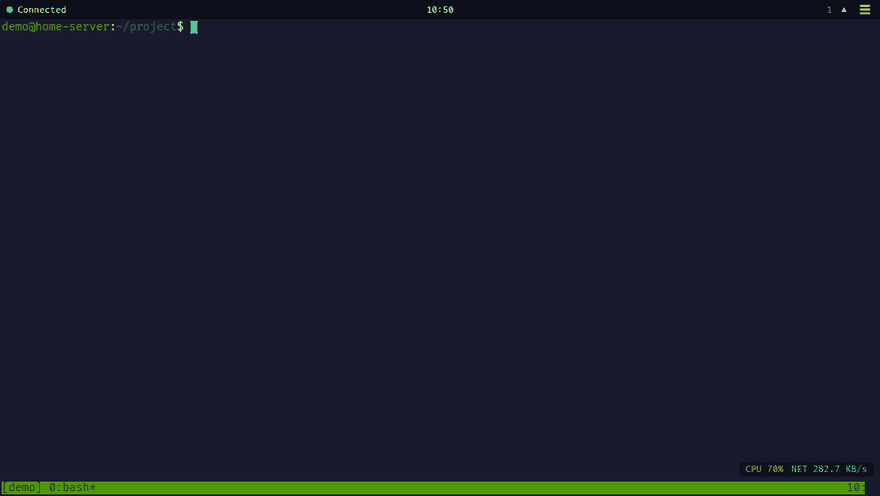
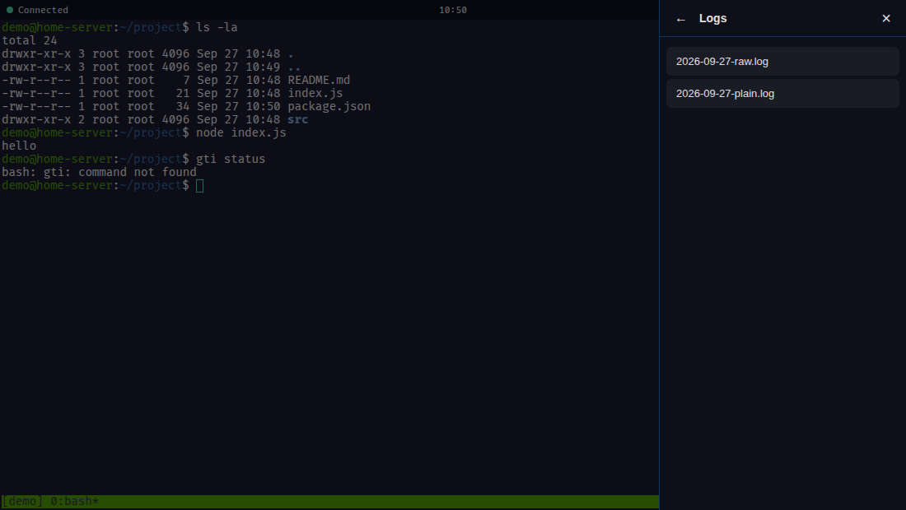
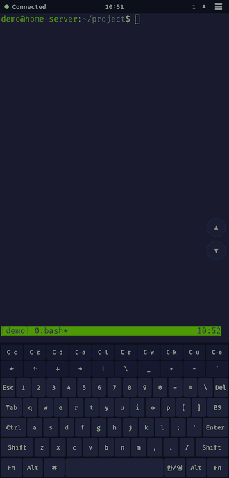
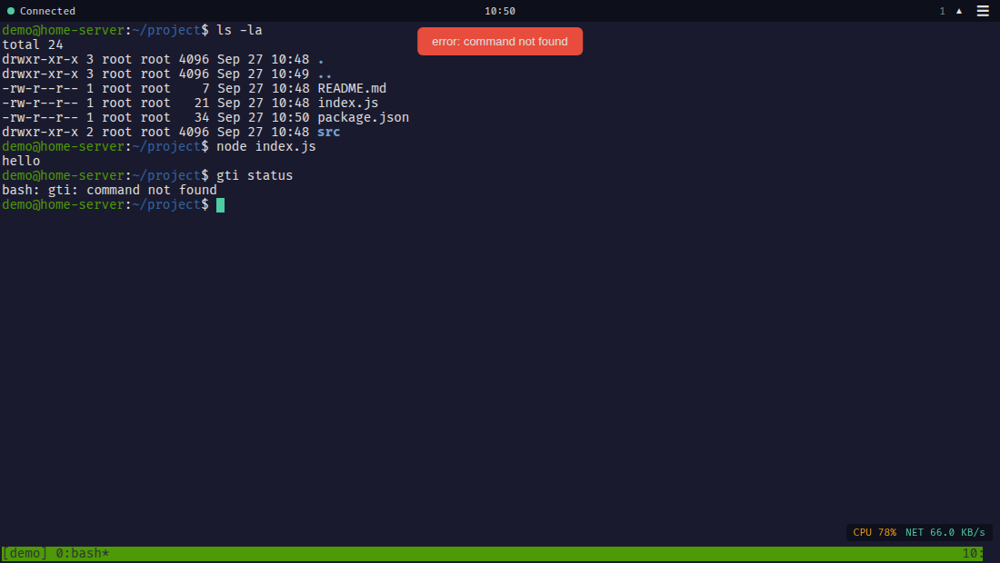

# OpenClaw Web Terminal

브라우저와 휴대폰에서 tmux 세션에 접속해 Claude Code CLI(Command Line Interface) 작업을 이어서 할 수 있는 웹 터미널입니다.

[English](README.en.md) | 한국어



## 주요 기능

- **웹 터미널**: xterm.js로 그린 터미널을 Socket.IO로 서버의 tmux 세션과 실시간으로 연결합니다. 여러 브라우저가 같은 세션을 함께 보고, 새로 접속하면 최근 출력(최대 100KB)을 다시 받아 옵니다.
- **자동 재접속**: tmux 연결이 끊기면 2초 뒤 다시 붙고, 브라우저도 Socket.IO로 자동 재연결합니다.
- **세션 로그**: 터미널 출력을 날짜별 파일로 `logs/`에 저장합니다. ANSI(American National Standards Institute) 색상 코드를 지운 `-plain.log`와 원본 그대로의 `-raw.log`를 함께 남깁니다.
- **패턴 알림**: 출력에서 권한 요청(`Allow`, `(y/n)` 등), 오류(`Error:`, `command not found` 등), 완료(`Done`, `Success` 등) 문구를 찾아 화면 상단에 알림을 띄웁니다. 같은 종류는 30초에 한 번만 알립니다.
- **Telegram 알림(선택)**: 오류와 권한 요청은 `openclaw` CLI를 통해 Telegram으로도 보냅니다.
- **AI(Artificial Intelligence) 요약(선택)**: 로컬 Ollama 모델로 당일 로그를 한국어로 요약합니다. 상단 ▲ 버튼 패널에서 스트리밍으로 보거나, 메뉴의 Summary에서 생성하고 저장된 요약(`summaries/`)을 열어 봅니다.
- **시스템 모니터**: 오른쪽 아래에 CPU(Central Processing Unit), GPU(Graphics Processing Unit, `nvidia-smi`가 있을 때만), 네트워크 사용량을 3초마다 표시합니다.
- **PWA(Progressive Web App)**: 홈 화면에 추가하면 전체 화면으로 열리고, 정적 파일과 FiraCode Nerd Font를 캐시합니다.
- **PWA 전용 키보드**: HHKB(Happy Hacking Keyboard) 배열 가상 키보드, `C-c`/`C-z` 같은 단축키 줄, 방향키, 고정(sticky) Ctrl/Alt, Fn 레이어(F1~F12, Home, PgDn 등), 두벌식 한글 입력(한/영 전환)을 제공합니다.
- **크기 조정 우선순위**: PC(Personal Computer) 브라우저가 접속해 있으면 PWA 쪽의 터미널 크기 변경 요청은 무시해 PC 화면이 깨지지 않게 합니다.

| 로그 보기(오른쪽 서랍 메뉴) | PWA 전용 키보드와 한글 입력 |
|---|---|
|  |  |



> 스크린샷은 이 저장소를 로컬에서 실제로 실행해 찍었습니다. 셸 프롬프트는 `demo@home-server`로 바꿨고, Ollama와 Telegram은 연결하지 않았습니다. PWA 화면은 브라우저의 `display-mode: fullscreen` 판정을 참으로 바꿔 PWA 모드 코드 경로를 띄운 것입니다.

## 사용 방법

### 1. 준비

- Node.js 18 이상, npm
- tmux (필수)
- node-pty 빌드 도구(`python3`, `make`, `g++`) — 미리 빌드된 바이너리가 없는 환경에서 필요합니다.
- 선택: Ollama(AI 요약), `openclaw` CLI(Telegram 알림), `nvidia-smi`(GPU 표시), Tailscale(원격 접속)

### 2. 설치

```bash
git clone https://github.com/patissierMongs/webTerminal.git
cd webTerminal
npm install
cp .env.example .env
```

`.env`에서 쓸 수 있는 값은 다음과 같습니다.

| 변수 | 기본값 | 설명 |
|------|--------|------|
| `PORT` | `3030` | HTTP(Hypertext Transfer Protocol) 포트 |
| `HOST` | `0.0.0.0` | 리슨 주소 |
| `TMUX_SESSION` | `openclaw` | 연결할 tmux 세션 이름(없으면 새로 만듭니다) |
| `TELEGRAM_CHAT_ID` | (비어 있음) | Telegram 수신자 ID. 비어 있으면 알림을 보내지 않습니다 |
| `OLLAMA_URL` | `http://localhost:11434` | Ollama API(Application Programming Interface) 주소 |
| `OLLAMA_MODEL` | `qwen3:30b-a3b` | 요약에 쓸 모델 |

### 3. 실행

```bash
./start.sh     # tmux/node 확인, logs·summaries 폴더와 tmux 세션 준비 후 서버 실행
# 또는
npm start      # node server.js
npm run dev    # 파일이 바뀌면 자동 재시작(node --watch)
```

`start.sh`는 셸 환경 변수의 `TMUX_SESSION`만 읽고 `.env`는 읽지 않습니다. `.env`에서 세션 이름을 바꿨다면 서버가 그 이름으로 세션을 따로 만듭니다.

### 4. 접속과 기본 사용

1. 브라우저에서 `http://<서버 주소>:3030`을 엽니다. 상단 왼쪽 점이 초록색이고 `Connected`로 바뀌면 연결된 것입니다.
2. 터미널을 클릭하고 평소처럼 명령을 입력합니다. 입력은 tmux 세션으로 그대로 전달됩니다.
3. 상단 오른쪽 숫자는 현재 접속한 클라이언트 수입니다.
4. ☰ 버튼을 누르면 오른쪽 서랍 메뉴가 열립니다.
   - **Logs**: 날짜별 로그 목록을 보고, 파일을 누르면 마지막 8,000자를 보여 줍니다.
   - **Summary**: `Generate New Summary`로 당일 로그를 요약하고, 저장된 요약을 엽니다(Ollama 필요).
   - **Reload**: 페이지를 새로 불러옵니다(PWA에서 새로고침 대신 사용).
5. ▲ 버튼은 Ollama 스트리밍 패널을 엽니다. `Run`을 누르면 요약이 생성되는 대로 표시됩니다.
6. 휴대폰에서는 브라우저 메뉴의 "홈 화면에 추가"로 설치하면 전용 키보드와 스크롤 버튼(▲/▼)이 나타납니다.

> **보안 주의**: 이 서버에는 로그인이나 토큰 인증이 없습니다. 접속할 수 있는 사람은 누구나 tmux 세션에서 명령을 실행할 수 있습니다. `HOST=127.0.0.1`로 묶거나 Tailscale 같은 사설 네트워크 안에서만 여세요. `start.sh`는 Tailscale이 설치되어 있으면 접속 주소를 출력합니다.

### HTTP API

| 메서드 | 경로 | 설명 |
|--------|------|------|
| `GET` | `/api/status` | tmux·PTY(pseudo-terminal) 상태, 클라이언트 수, Ollama 사용 가능 여부 |
| `GET` | `/api/logs` | 로그 파일 목록 |
| `GET` | `/api/logs/:filename` | 로그 파일 내용 |
| `POST` | `/api/summarize` | 요약 생성(본문 `{ "filename": "..." }`, 생략하면 당일 plain 로그) |
| `GET` | `/api/summaries` | 요약 파일 목록 |
| `GET` | `/api/summaries/:filename` | 요약 파일 내용 |
| `GET` | `/api/monitor` | CPU/GPU/네트워크 사용량 |

Socket.IO 이벤트는 클라이언트→서버 `input`, `resize`, `register`, `ollama-summarize`와 서버→클라이언트 `output`, `alert`, `client-count`, `pty-dimensions`, `pty-exit`, `ollama-start`/`ollama-chunk`/`ollama-done`/`ollama-error`가 있습니다(`server.js`).

## 기술 스택

| 구분 | 사용 기술 |
|------|-----------|
| 언어 | JavaScript(Node.js 18 이상, 브라우저 Vanilla JS), Bash |
| 서버 | Express `^4.21.2`, Socket.IO `^4.8.1`, node-pty `^1.0.0`, dotenv `^16.4.7`, strip-ansi `^7.1.0` |
| 프런트엔드 | xterm.js `5.5.0`, `@xterm/addon-fit` `0.10.0`, `@xterm/addon-web-links` `0.11.0`(jsDelivr CDN(Content Delivery Network)), Service Worker, Web App Manifest |
| 폰트 | FiraCode Nerd Font(WOFF2(Web Open Font Format 2), 로컬 제공) |
| 외부 도구 | tmux(필수), Ollama·`openclaw` CLI·`nvidia-smi`·Tailscale(선택) |

## 문서

- [진행 기록](docs/PROGRESS.md) — 목표, 기능별 구현 상태, 작업 이력
